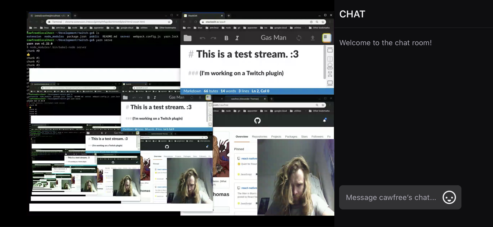

# Twitch a Goooooooooooo!*

<p align="center">
  <a href="https://www.twitch.tv">
    
  </a>
</p>

🎮 A Twitch streaming extension for [chromebooks](https://www.google.com/intl/en_uk/chromebook/shop/?gclid=Cj0KCQjwybD0BRDyARIsACyS8muo3qfeKIJWHwOoFbmLGwCfeMXNERYLXMupIJj7iA9Y2lbPjjP-ndUaAsDjEALw_wcB&gclsrc=aw.ds). Now you can share your online adventures (or lonely isolation) with the rest of the gaming world.

## 1. about

Twitch is a video streaming service where both competitive gamers and filthy causals come together as one to share high-quality gaming footage, fight for speed running world records and compete with one-another for _epic loot_.

This repository aims to help Chromebook users to get involved, by enabling their Chrome desktop to be streamed directly to [Twitch](https://www.twitch.tv/) with low latency, with the help of a little extension.

## 2. installing

Installation is split into two main pieces. The first is configuring the media transcoding server (it just _sounds_ difficult) and the second is compiling the extension to install to your Chrome browser.

### 2.1 preparing your environment

Your development environment will be used to host the barebones media server, written using [express](https://github.com/expressjs/express) and powered by [ffmpeg](https://github.com/FFmpeg/FFmpeg). This doesn't have to be on your Chromebook; it can be any accessible IP on your network. However, this works just as fine directly on the same Chromebook from within the [crouton](https://ubuntu.com/tutorials/install-ubuntu-on-chromebook) shell.

The extension will be compiled from this project and then installed to [Chrome](https://www.google.com/chrome/).

**Note:**

> Originally, this repository was aiming at accomplishing everything using just a single extension. There have been some [truly great strides](https://github.com/ffmpegjs/ffmpeg.js/) towards embedding [ffpmeg in JavaScript](https://itnext.io/build-ffmpeg-webassembly-version-ffmpeg-js-part-5-ffmpeg-js-v0-3-pre-js-and-live-streaming-c1498939a74c) and [WebAssembly](https://webassembly.org/), however it does not at this time seem possible to hit the [TCP/IP-based](https://en.wikipedia.org/wiki/Real-Time_Messaging_Protocol) `rtmp://` protocol directly from [emscripten](https://emscripten.org/).

  1. First, ensure you have the latest version of [ffmpeg](http://ffmpeg.org/download.html) installed.
     ([apt-get](https://tecadmin.net/install-ffmpeg-on-linux/)) ([brew](https://formulae.brew.sh/formula/ffmpeg))
  2. Next, you need to have [the Node.js runtime installed](https://nodejs.org/en/download/).
  3. Then, you need to clone this repo.
     `git clone https://github.com/cawfree/twitch-go`
  4. `cd` into the downloaded repo and hit `npm install`. This will download all of the required dependencies.
  5. Finally, inside the project directory you will need to create a [`.env`](https://www.npmjs.com/package/dotenv) file to store your Twitch access credentials. These will look like the following:

```env
PORT=8080
INGEST=rtmp://live-lhr03.twitch.tv/app
TWITCH_SECRET=live_xxxxxxxxxxxxxxxxxxxxxxxxxxxxxxxxxxxxxxxx
FRAME_RATE=20
BUFFER_LENGTH=10
DURATION=3000
```

You can then run your server with a call to `npm run-script serve`. 

### 2.2 building  your extension

  1. Once your server is configured, you can build your shiny new Chrome extension by running `npm run-script build`. This will create your extension in a new `dist/` directory inside the project folder.
  2. In the Chrome browser, head to [chrome://extensions](chrome://extensions).
  3. Click on **Load Unpacked**.
  4. Navigate to the `dist/` folder and select to install.

## 3. license
[MIT](https://opensource.org/licenses/MIT)

<sub>
* if you read in a mario voice then you win
</sub>
